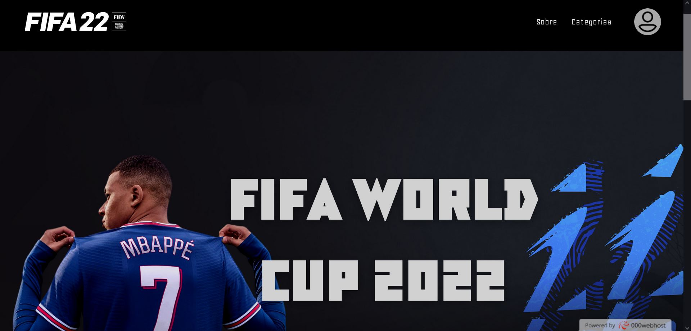

# :soccer: FIFA World Cup Data Management System :soccer:
:brazil:<b> Projeto dedicado ao SENAI-SP, para trabalhar com dados relacionados com a <a href="https://www.fifa.com/tournaments/mens/worldcup">Copa do Mundo FIFA.</a></b> 

Foi proposto como atividade de sala, trabalhar com uma empresa fictícia que controlaria os dados da FIFA (jogadores, estádios, grupos, etc.) em um sistema online.  O projeto possui os seguintes itens:
  
  * Sistema CRUD com países, estádios, grupos, jogadores, jogos e usuários;
  * Sistema de Login e Cadastro, com 3 níveis de acesso (admin, usuário e visitante);  
##
:us:<b> Dedicated project for SENAI-SP, to work with data related to the <a href="https://www.fifa.com/tournaments/mens/worldcup">FIFA World Cup.</a></b> 

It was proposed as a class activity, to work with a fictitious company that would control FIFA data (players, stadiums, groups, etc.) in an online system.  The project has the following items:

  * CRUD system with countries, stadiums, groups, players, games and users;
  * Login and Registration system, with 3 levels of access (admin, user and visitor);  

 <i><b>Made with <a href="https://www.wampserver.com/en/">WampServer</a> 
Languages: 
  :computer: Front-End: HTML, CSS & JavaScript 
  :1234: Back-End: PHP & SQL 
  :floppy_disk: Database Administration: phpMyAdmin 
  :globe_with_meridians: Web Hosting: 000WebHost 
  
Project Status: Completed :heavy_check_mark:

</b></i>

## Preview

  
## CRUD

:trophy: Admin possui acesso completo ao CRUD // Admin has full access to CRUD;

:trophy: Usuário pode apenas listar as tabelas // User can only list the tables;

:trophy: Visitante não possui acesso nenhum // Visitor has no access at all.

## Preparação do Projeto - Project Setup
:brazil:
* É necessário um ambiente com Apache, PHP e o MySQL;
  * Recomendamos baixar algumas soluções com pacotes de desenvolvimento embutidos, como o <a href="https://www.wampserver.com/en/">WampServer</a> ou <a href="https://www.apachefriends.org/index.html">XAMPP</a>;
* Após a instalação, coloque a pasta no diretório raiz do servidor;
* Entre na ferramenta de administração de banco de dados, e execute os comandos do arquivo "copa_mundo-complete-login.sql", presente na pasta "sql";
* Após a inserção das tabelas e dados, o seu projeto estará configurado.
##
:us:
* An environment with Apache, PHP and MySQL is required;
  * We recommend downloading some solutions with built-in development packages, such as <a href="https://www.wampserver.com/en/">WampServer</a> or <a href="https://www.apachefriends.org/index.html">XAMPP</a>;
* After installation, place the folder in the root directory of the server;
* Enter the database administration tool, and run the commands from the file "copa_mundo-complete-login.sql", present in the "sql" folder;
* After inserting the tables and data, your project is configured.
  
## Slides
<a href="https://bit.ly/3IXri4S">Clique aqui para o slide / Click here to slideshow</a>

## Acesse agora o site pelo QR code - Access the site now by QR code

